# 1. 多边形裁剪简介


# 1.1 多边形裁剪是什么

用一个多边形去裁剪另一个多边形，分为两种情况


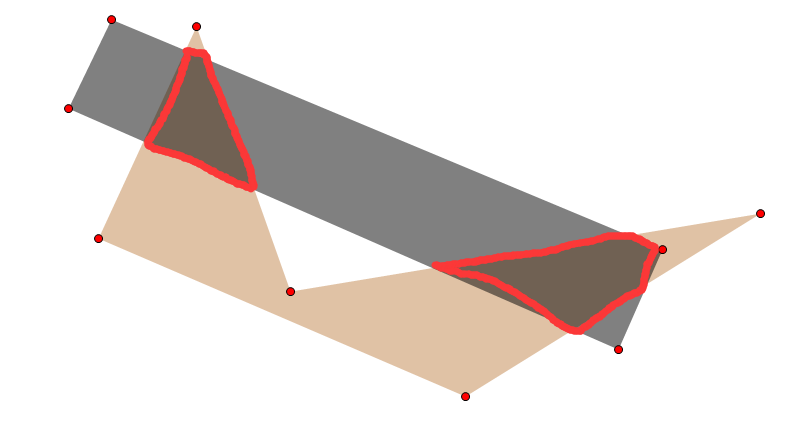


- 内裁剪：内裁剪即通常意义上的裁剪，取图元位于窗口之内的部分，结果为A∩B。

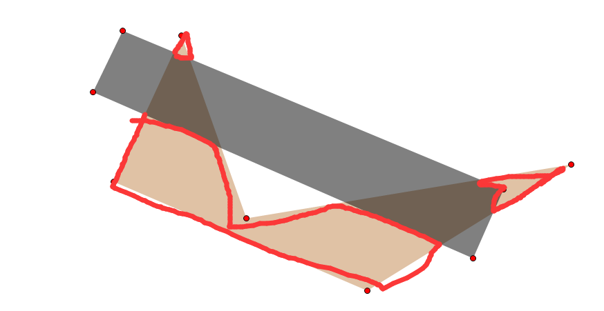

- 外裁剪：外裁剪取图元位于窗口之外的部分，结果为A－B。


## 1.2 如何实现多边形裁剪

### 1.2.1 Sutherland－Hodgeman算法

Sutherland－Hodgeman算法解决了裁剪窗口为凸多边形窗口的问题，但一些应用需要涉及任意多边形窗口（含凹多边形窗口）的裁剪。

例：如下图形，但正确的裁剪结果应该为最右边的图。

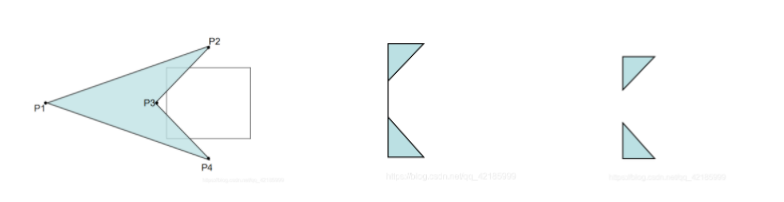


### 1.2.2 Weiler-Atherton算法

在算法中，裁剪窗口、被裁剪多边形可以是任意多边形：凸的、凹的（内角大于180o）、甚至是带有内环的（子区），见下图。

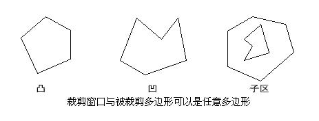


# 2. 算法步骤

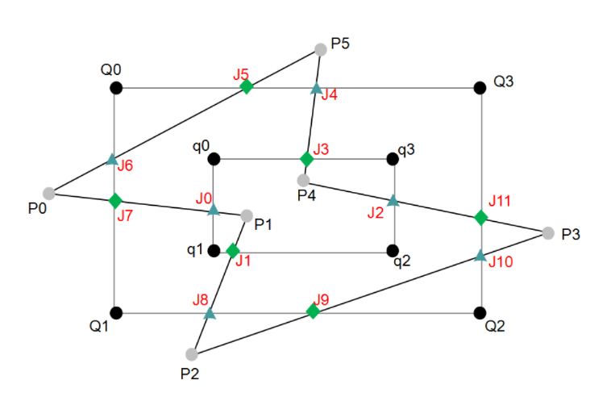

P为主多边形，Q为裁剪多边形。


由于多边形构成一个封闭的区域，所以，如果被裁剪多边形和裁剪窗口有交点，则交点成对出现。这些交点分成两类：

一类称 “进” 点，即被裁剪多边形由此点进入裁剪窗口，如图中  J1,J3,J5,J7,J9 ,J11这几个点；
一类称 “出” 点，即被裁剪多边形由此点离开裁剪窗口，如图中  J0,J2,J4,J6,J8 ,J10这几个点 。

## 2.1  建立主多边形和裁剪多边形的顶点表，如下图所示。


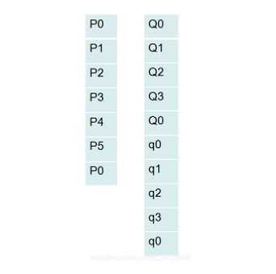

## 2.2 求主多边形和裁剪多边形的交点，并将这些交点按顺序插入两个多边形的顶点表中。在两多边形顶点表中的相同交点间建立双向指针。

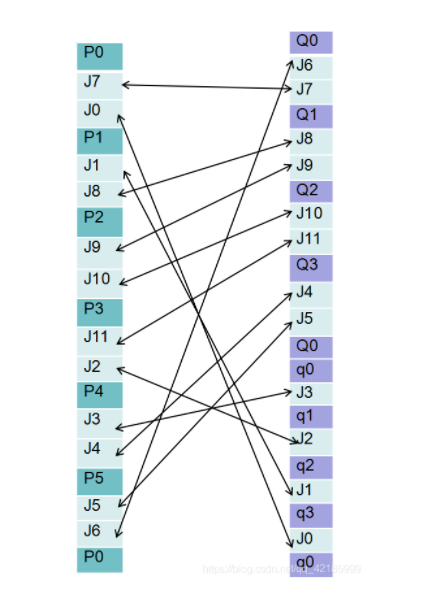

## 2.3 建立裁剪结果多边形顶点表，随后进行裁剪。


## 2.4 选取任意没有被遍历过的点为起始点，将其输出到结果多边形顶点表中

比如选择J7为起始点，随后进行遍历。


## 2.5 如果该交点为 入点 ，遍历主多边形边界；否则遍历裁剪多边形边界。


## 2.6 遍历多边形边界，每遇到多边形顶点，将其输出到结果多边形顶点表中，直到遇到新的交点。


## 2.7 将该交点输出到结果多边形顶点表中，并通过连接该交点的双向指针改变遍历方向（如果上一步遍历的是主多边形边界，现在改为遍历裁剪多边形边界）。


## 2.8 重复第 6 、7 步直到回到起点。

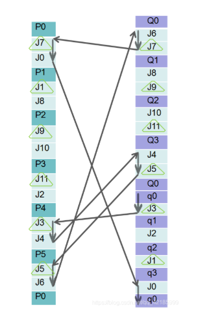


# 3. 结果


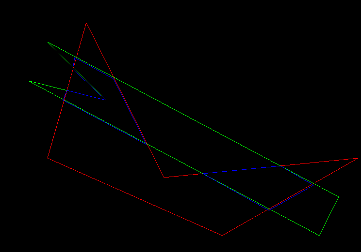


# 4. 需要解决哪几个点


## 4.1 如何找交点


> 默认技能：求两条线段的交点

```C++
namespace GetLineCross {
    bool IsRectCross(const Point &p1, const Point &p2, const Point &q1, const Point &q2) {
        bool ret = min(p1.x, p2.x) <= max(q1.x, q2.x) &&
                   min(q1.x, q2.x) <= max(p1.x, p2.x) &&
                   min(p1.y, p2.y) <= max(q1.y, q2.y) &&
                   min(q1.y, q2.y) <= max(p1.y, p2.y);
        return ret;
    }

    bool IsLineSegmentCross(const Point &pFirst1, const Point &pFirst2, const Point &pSecond1, const Point &pSecond2) {
        long line1, line2;
        line1 = pFirst1.x * (pSecond1.y - pFirst2.y) +
                pFirst2.x * (pFirst1.y - pSecond1.y) +
                pSecond1.x * (pFirst2.y - pFirst1.y);
        line2 = pFirst1.x * (pSecond2.y - pFirst2.y) +
                pFirst2.x * (pFirst1.y - pSecond2.y) +
                pSecond2.x * (pFirst2.y - pFirst1.y);
        if (((line1 ^ line2) >= 0) && !(line1 == 0 && line2 == 0))
            return false;

        line1 = pSecond1.x * (pFirst1.y - pSecond2.y) +
                pSecond2.x * (pSecond1.y - pFirst1.y) +
                pFirst1.x * (pSecond2.y - pSecond1.y);
        line2 = pSecond1.x * (pFirst2.y - pSecond2.y) +
                pSecond2.x * (pSecond1.y - pFirst2.y) +
                pFirst2.x * (pSecond2.y - pSecond1.y);
        if (((line1 ^ line2) >= 0) && !(line1 == 0 && line2 == 0))
            return false;
        return true;
    }

    bool GetCrossPoint(const Point &p1, const Point &p2, const Point &q1, const Point &q2, int &x, int &y) {
        if (IsRectCross(p1, p2, q1, q2)) {
            if (IsLineSegmentCross(p1, p2, q1, q2)) {
                //求交点
                long tmpLeft, tmpRight;
                tmpLeft = (q2.x - q1.x) * (p1.y - p2.y) - (p2.x - p1.x) * (q1.y - q2.y);
                tmpRight = (p1.y - q1.y) * (p2.x - p1.x) * (q2.x - q1.x) + q1.x * (q2.y - q1.y) * (p2.x - p1.x) -
                           p1.x * (p2.y - p1.y) * (q2.x - q1.x);

                x = (int) ((double) tmpRight / (double) tmpLeft);

                tmpLeft = (p1.x - p2.x) * (q2.y - q1.y) - (p2.y - p1.y) * (q1.x - q2.x);
                tmpRight = p2.y * (p1.x - p2.x) * (q2.y - q1.y) + (q2.x - p2.x) * (q2.y - q1.y) * (p1.y - p2.y) -
                           q2.y * (q1.x - q2.x) * (p2.y - p1.y);
                y = (int) ((double) tmpRight / (double) tmpLeft);
                return true;
            }
        }
        return false;
    }
}
```


## 4.2 找完交点如何确定为入点还是出点


> 错误案例：认为相对应的入点和出点都在同一条边（都在主多边形或者都在裁剪多边形？）
>
> 如下图：

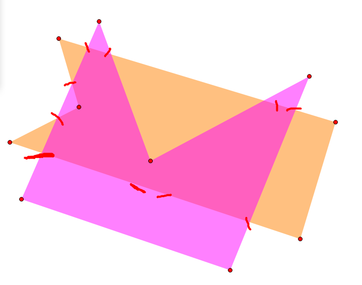


### 我的做法

由于入点和出点一定在某一个多边形的一条边上，那在哪一条我们不清楚，所以：

- 先固定主多边形的一条边，扫描裁剪多边形
- 得到交点之后，这些交点一定在固定主多边形的那条边上，所以可以用链表存储顺序后插入
- 反之，先固定裁剪多边形的一条边，扫描主多边形即可


> 上述处理之后


### 前

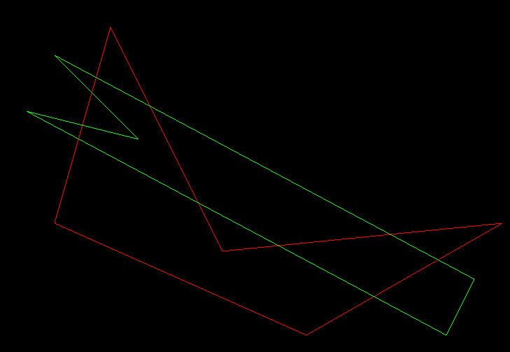

### 后

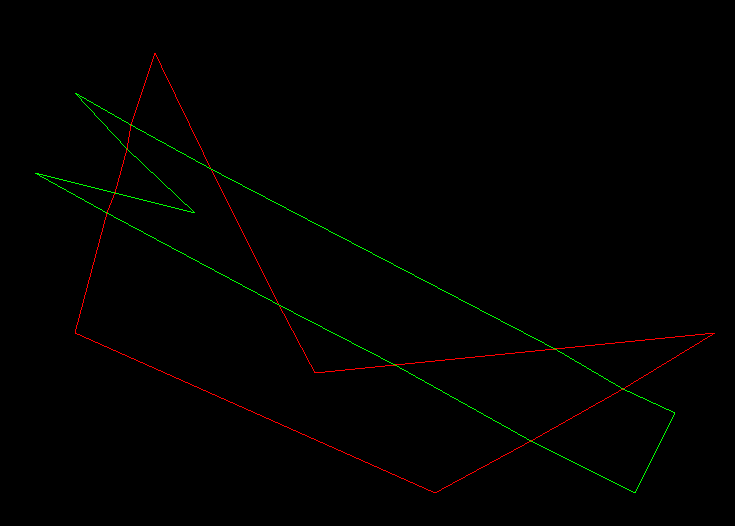


==坐标都是int，所以会有点误差。==


### 另一种做法

- 给交点打上标记后顶点排序

- 遍历主多边形顶点表，遇到交点按照入、出标记交点

- 把第一个遇到的交点设为入点，这样它之后的遍历会正确的。


==但是，凸多边形可以排序，思考了很久，凹多边形貌似目前我没有办法==


## 4.3 如何遍历

- 随机在主多边形内找一个没有被遍历到的入点
- 如果当前点是入点，遍历主多边形，否则遍历裁剪多边形
- 当遇到相对应的入/出点时，通过“双向指针”改变遍历方向
- 遍历过程中遇到的点存储到ans里

```c++
	vector<polygon> ans(1); // 裁剪结果多边形顶点表
    map<pair<int, int>, int> vis;
    int num = 0;
    // 遍历
    while(true) {
        if(mapPoint.empty()) break ;

        // 随机一个入点为起点
        int start;
        for(int i = 0;i < qv.size(); i++) {
            if(vis[pair<int, int>{qv[i].x, qv[i].y}] == 1) continue ;
            if(mapPoint[pair<int, int>{qv[i].x, qv[i].y}] == 1) {
                start = i;
                break ;
            }
            else mapPoint.erase(pair<int, int>{qv[i].x, qv[i].y});
        }

        // 从入点start开始走
        opt = 0;
        while(true) {
            if((opt == 0 && vis[{qv[start].x, qv[start].y}] == 1) || (opt == 1 && vis[{pv[start].x, pv[start].y}] == 1)) {
                ans.resize(ans.size() + 1);
                num++;
                break ;
            }
            if(opt == 0) {
                ans[num].push_back(Point{qv[start].x, qv[start].y});
                mapPoint.erase({qv[start].x, qv[start].y});
                vis[{qv[start].x, qv[start].y}] = 1;
            }
            else {
                ans[num].push_back(Point{pv[start].x, pv[start].y});
                mapPoint.erase({pv[start].x, pv[start].y});
                vis[{pv[start].x, pv[start].y}] = 1;
            }
            int nxt = (start + 1);
            if(opt == 0) nxt %= (int)qv.size();
            else nxt %= (int)pv.size();
            if(opt == 0) { // 入点走主多边形
                if(qv[nxt].flag == 2) {
                    opt ^= 1;
                    start = mapNextQ[nxt];
                }
                else start = nxt;
            }
            else { // 出点走裁剪多边形
                if(pv[nxt].flag == 1) {
                    opt ^= 1;
                    start = mapNextP[nxt];
                }
                else start = nxt;
            }
        }
    }
```


## 4.4 特殊情况

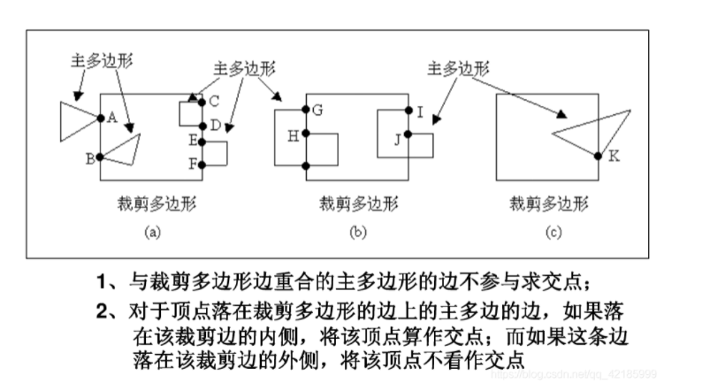


# 5. 完结撒花


参考链接：

- https://blog.csdn.net/qq_42185999/article/details/102955354?spm=1001.2101.3001.6650.8&utm_medium=distribute.pc_relevant.none-task-blog-2~default~BlogCommendFromBaidu~default-8.no_search_link&depth_1-utm_source=distribute.pc_relevant.none-task-blog-2~default~BlogCommendFromBaidu~default-8.no_search_link

- https://blog.csdn.net/yangxi_pekin/article/details/37738219
- https://www.cnblogs.com/dwdxdy/p/3232110.html